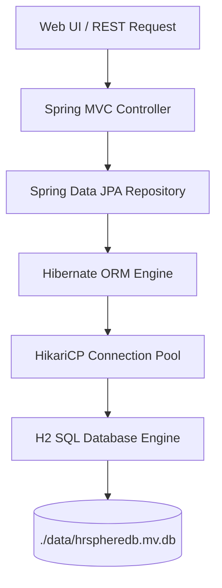
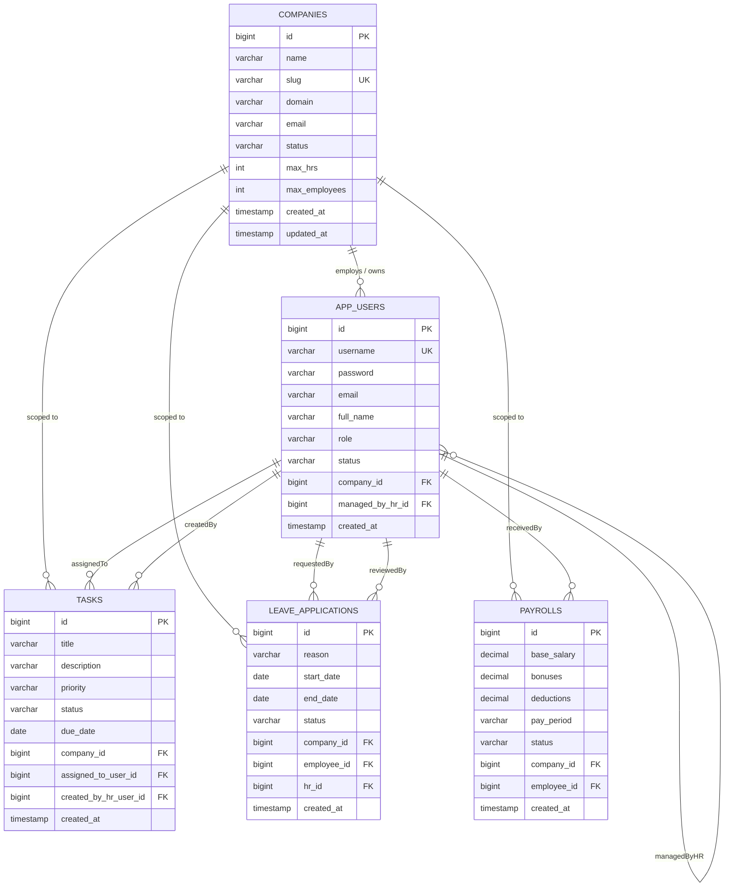

# 🗄️ HR Sphere SaaS — Database Architecture, Connection & Query Reference Guide

This comprehensive guide explains how the **HR Sphere SaaS** database is structured, how it connects to the application, how Hibernate and Spring Data JPA manage data lifecycle and multi-tenancy, and provides a complete catalog of all SQL queries used across the system.

---

## 📑 Table of Contents
1. [Database Architecture & Connection Guide](#1-database-architecture--connection-guide)
2. [How the Database Works (Internal Engine & Lifecycle)](#2-how-the-database-works-internal-engine--lifecycle)
3. [Multi-Tenancy & Cascade Access Lock Architecture](#3-multi-tenancy--cascade-access-lock-architecture)
4. [Interactive Entity-Relationship (ER) Diagram](#4-interactive-entity-relationship-er-diagram)
5. [Table Schema Specifications](#5-table-schema-specifications)
6. [Spring Data JPA Repositories & SQL Query Catalog](#6-spring-data-jpa-repositories--sql-query-catalog)
7. [Raw SQL Execution Reference (DDL & DML)](#7-raw-sql-execution-reference-ddl--dml)
8. [Accessing the Live Database via H2 Web Console](#8-accessing-the-live-database-via-h2-web-console)

---

## 1. Database Architecture & Connection Guide

### 🔌 Connection Parameters
HR Sphere uses an **embedded file-based H2 SQL Database Engine**. This provides a zero-setup, self-contained relational database that persists data directly on disk across server restarts.

| Parameter | Configuration Value | Explanation |
| :--- | :--- | :--- |
| **Driver Class** | `org.h2.Driver` | The JDBC driver for H2 database engine. |
| **JDBC URL** | `jdbc:h2:file:./data/hrspheredb;DB_CLOSE_DELAY=-1;AUTO_SERVER=TRUE` | Connects to file `./data/hrspheredb.mv.db`. |
| **Username** | `sa` | Default system administrator user. |
| **Password** | `sa` | Default password. |
| **Connection Pool** | `HikariCP` | Ultra-fast production-ready connection pool bundled with Spring Boot. |
| **Physical Storage File** | `./data/hrspheredb.mv.db` | Local file storing all tables, rows, indexes, and constraints. |

### ⚙️ Breakdown of JDBC URL Parameters:
- **`file:./data/hrspheredb`**: Instructs H2 to store data in a persistent local disk file in the `data/` directory.
- **`DB_CLOSE_DELAY=-1`**: Keeps the in-memory cache alive as long as the JVM is running, avoiding unintended database shutdowns between requests.
- **`AUTO_SERVER=TRUE`**: Enables automatic mixed-mode access, allowing external tools (like the H2 Web Console or DBeaver) to connect concurrently while the Spring Boot app is running.

---

## 2. How the Database Works (Internal Engine & Lifecycle)



### 🔄 Data Lifecycle & Synchronization:
1. **Startup & Schema Auto-Generation (`ddl-auto: update`)**:
   - On application startup, Hibernate inspects all JPA entity classes (`@Entity` annotations on `AppUser`, `Company`, `Task`, `LeaveApplication`, `Payroll`).
   - If tables do not exist, Hibernate automatically creates them with primary keys, unique constraints, and foreign key relations.
   - If new columns are added to Java model classes, Hibernate alters the existing tables without wiping existing records.

2. **Connection Pooling via HikariCP**:
   - When a web request arrives, a database connection is leased from the HikariCP pool.
   - SQL queries are executed within the context of the active transaction.
   - Once the controller or service method completes, the connection is returned to the pool for reuse.

3. **Transaction Management & Atomicity**:
   - Changes made to multiple related entities (e.g. creating a tenant company and simultaneously generating its default Company Admin user) are executed within database transactions to ensure ACID compliance.

---

## 3. Multi-Tenancy & Cascade Access Lock Architecture

HR Sphere employs a **Discriminator Column Multi-Tenancy Architecture** combined with a **Cascade Access Lock**:

1. **Discriminator Column (`company_id`)**:
   - Every tenant-scoped entity (`app_users`, `tasks`, `leave_applications`, `payrolls`) contains a foreign key reference (`company_id`) pointing to `companies(id)`.
   - Repositories enforce tenant isolation by filtering all queries with `WHERE company_id = :companyId`.

2. **Cascade Access Lock**:
   - When a Super Admin suspends a company (`companies.status = 'SUSPENDED'`), the security subsystem evaluates the parent company status in `AppUser.isEnabled()`.
   - **Result**: All Company Admins, HR Managers, and Employees belonging to that company are instantly blocked from authenticating, without needing to update individual user status flags.

---

## 4. Interactive Entity-Relationship (ER) Diagram



---

## 5. Table Schema Specifications

### 1. `companies` (Tenant Organizations)
| Column Name | SQL Type | Constraints | Description |
| :--- | :--- | :--- | :--- |
| `id` | `BIGINT` | `PRIMARY KEY`, `AUTO_INCREMENT` | Unique identifier for each company. |
| `name` | `VARCHAR(200)` | `NOT NULL` | Formal business name of the tenant. |
| `slug` | `VARCHAR(100)` | `NOT NULL`, `UNIQUE` | URL code / identifier for the company. |
| `domain` | `VARCHAR(200)` | `NULLABLE` | Company web address or email domain. |
| `email` | `VARCHAR(150)` | `NULLABLE` | Primary corporate contact email. |
| `status` | `VARCHAR(30)` | `NOT NULL` (`ACTIVE`, `SUSPENDED`) | Organization access state. |
| `max_hrs` | `INTEGER` | `NOT NULL` (Default `5`) | Maximum allowed HR managers. |
| `max_employees` | `INTEGER` | `NOT NULL` (Default `100`) | Maximum allowed employees. |
| `created_at` | `TIMESTAMP` | `NOT NULL` | Registration timestamp. |
| `updated_at` | `TIMESTAMP` | `NOT NULL` | Last update timestamp. |

---

### 2. `app_users` (System Users & Credentials)
| Column Name | SQL Type | Constraints | Description |
| :--- | :--- | :--- | :--- |
| `id` | `BIGINT` | `PRIMARY KEY`, `AUTO_INCREMENT` | Unique user identifier. |
| `username` | `VARCHAR(120)` | `NOT NULL`, `UNIQUE` | User login username. |
| `password` | `VARCHAR(255)` | `NOT NULL` | BCrypt-hashed password. |
| `email` | `VARCHAR(150)` | `NULLABLE` | User email address. |
| `full_name` | `VARCHAR(150)` | `NOT NULL` | Display name of the user. |
| `role` | `VARCHAR(30)` | `NOT NULL` | Role: `SUPERADMIN`, `COMPANY_ADMIN`, `HR`, `EMPLOYEE`. |
| `status` | `VARCHAR(30)` | `NOT NULL` (`ACTIVE`, `INACTIVE`) | Individual user account status. |
| `company_id` | `BIGINT` | `FOREIGN KEY` -> `companies(id)` | Associated company (`NULL` for SUPERADMIN). |
| `managed_by_hr_id` | `BIGINT` | `FOREIGN KEY` -> `app_users(id)` | Assigning HR Manager (`NULL` if not applicable). |
| `created_at` | `TIMESTAMP` | `NOT NULL` | Account creation timestamp. |

---

### 3. `tasks` (Task Assignments & Work Tracking)
| Column Name | SQL Type | Constraints | Description |
| :--- | :--- | :--- | :--- |
| `id` | `BIGINT` | `PRIMARY KEY`, `AUTO_INCREMENT` | Unique task identifier. |
| `company_id` | `BIGINT` | `NOT NULL`, `FK` -> `companies(id)` | Tenant company isolation key. |
| `assigned_to_user_id`| `BIGINT` | `NOT NULL`, `FK` -> `app_users(id)` | Target employee working on the task. |
| `created_by_hr_user_id`| `BIGINT` | `NOT NULL`, `FK` -> `app_users(id)` | HR manager who delegated the task. |
| `title` | `VARCHAR(250)` | `NOT NULL` | Brief headline of the task. |
| `description` | `VARCHAR(4000)`| `NOT NULL` | Detailed work instructions. |
| `priority` | `VARCHAR(30)` | `NOT NULL` (`LOW`, `MEDIUM`, `HIGH`) | Urgency level. |
| `status` | `VARCHAR(30)` | `NOT NULL` (`PENDING`, `IN_PROGRESS`, `COMPLETED`) | Current lifecycle stage. |
| `due_date` | `DATE` | `NULLABLE` | Expected completion date. |
| `created_at` | `TIMESTAMP` | `NOT NULL` | Date when task was dispatched. |

---

### 4. `leave_applications` (Time-Off & Leave Management)
| Column Name | SQL Type | Constraints | Description |
| :--- | :--- | :--- | :--- |
| `id` | `BIGINT` | `PRIMARY KEY`, `AUTO_INCREMENT` | Unique leave request identifier. |
| `company_id` | `BIGINT` | `NOT NULL`, `FK` -> `companies(id)` | Tenant company key. |
| `employee_id` | `BIGINT` | `NOT NULL`, `FK` -> `app_users(id)` | Employee requesting time off. |
| `hr_id` | `BIGINT` | `NULLABLE`, `FK` -> `app_users(id)` | HR manager who reviewed the request. |
| `reason` | `VARCHAR(1000)`| `NOT NULL` | Justification / notes for the leave. |
| `start_date` | `DATE` | `NOT NULL` | Leave start date. |
| `end_date` | `DATE` | `NOT NULL` | Leave return date. |
| `status` | `VARCHAR(30)` | `NOT NULL` (`PENDING`, `APPROVED`, `REJECTED`) | Approval outcome. |
| `created_at` | `TIMESTAMP` | `NOT NULL` | Request submission date. |

---

### 5. `payrolls` (Salary & Payslip Records)
| Column Name | SQL Type | Constraints | Description |
| :--- | :--- | :--- | :--- |
| `id` | `BIGINT` | `PRIMARY KEY`, `AUTO_INCREMENT` | Unique payslip identifier. |
| `company_id` | `BIGINT` | `NOT NULL`, `FK` -> `companies(id)` | Tenant company key. |
| `employee_id` | `BIGINT` | `NOT NULL`, `FK` -> `app_users(id)` | Recipient employee. |
| `base_salary` | `DECIMAL(12,2)`| `NOT NULL` | Fixed monthly wage component. |
| `bonuses` | `DECIMAL(12,2)`| `NOT NULL` (Default `0.00`) | Additional incentives or performance bonus. |
| `deductions` | `DECIMAL(12,2)`| `NOT NULL` (Default `0.00`) | Taxes, PF, or unpaid absence deductions. |
| `pay_period` | `VARCHAR(50)` | `NOT NULL` | Billing month (e.g. `August 2026`). |
| `status` | `VARCHAR(30)` | `NOT NULL` (`PENDING`, `PAID`) | Disbursal status. |
| `created_at` | `TIMESTAMP` | `NOT NULL` | Generation date. |

---

## 6. Spring Data JPA Repositories & SQL Query Catalog

### 📦 1. `AppUserRepository`
| Spring Data JPA Method | Equivalent Raw SQL Query | Purpose / Usage Scenario |
| :--- | :--- | :--- |
| `findByUsername(String username)` | `SELECT * FROM app_users WHERE username = ?;` | User login authentication & credential lookup. |
| `findByCompanyId(Long companyId)` | `SELECT * FROM app_users WHERE company_id = ?;` | Fetch all staff members belonging to a tenant. |
| `findByCompanyIdAndRole(Long companyId, UserRole role)` | `SELECT * FROM app_users WHERE company_id = ? AND role = ?;` | List all HR managers or Employees in a company. |
| `findByManagedByHRId(Long hrId)` | `SELECT * FROM app_users WHERE managed_by_hr_id = ?;` | HR dashboard: list employees assigned to an HR. |
| `countByCompanyIdAndRole(Long companyId, UserRole role)` | `SELECT COUNT(*) FROM app_users WHERE company_id = ? AND role = ?;` | Quota enforcement: verify max HR/Employee limits. |
| `countByCompanyIdAndStatus(Long companyId, UserStatus status)` | `SELECT COUNT(*) FROM app_users WHERE company_id = ? AND status = ?;` | Tenant analytics: count active vs inactive users. |
| `countByStatus(UserStatus status)` | `SELECT COUNT(*) FROM app_users WHERE status = ?;` | Super Admin dashboard: system-wide active user count. |

---

### 🏢 2. `CompanyRepository`
| Spring Data JPA Method | Equivalent Raw SQL Query | Purpose / Usage Scenario |
| :--- | :--- | :--- |
| `findBySlug(String slug)` | `SELECT * FROM companies WHERE slug = ?;` | Slug availability check during tenant creation. |
| `findAll()` | `SELECT * FROM companies ORDER BY id;` | Super Admin dashboard: list all tenant companies. |
| `count()` | `SELECT COUNT(*) FROM companies;` | Super Admin KPI: total registered organizations. |
| `deleteById(Long id)` | `DELETE FROM companies WHERE id = ?;` | Super Admin: delete a company and its configuration. |

---

### 📋 3. `TaskRepository`
| Spring Data JPA Method | Equivalent Raw SQL Query | Purpose / Usage Scenario |
| :--- | :--- | :--- |
| `findByCompanyId(Long companyId)` | `SELECT * FROM tasks WHERE company_id = ?;` | Company Admin dashboard: all company tasks. |
| `findByCompanyIdAndAssignedToId(Long companyId, Long empId)` | `SELECT * FROM tasks WHERE company_id = ? AND assigned_to_user_id = ?;` | Employee portal: fetch personal task queue. |
| `findByCompanyIdAndCreatedById(Long companyId, Long hrId)` | `SELECT * FROM tasks WHERE company_id = ? AND created_by_hr_user_id = ?;` | HR manager portal: track delegated tasks. |
| `countByCompanyId(Long companyId)` | `SELECT COUNT(*) FROM tasks WHERE company_id = ?;` | Company KPI: total delegated tasks. |
| `countByCompanyIdAndStatus(Long companyId, TaskStatus status)` | `SELECT COUNT(*) FROM tasks WHERE company_id = ? AND status = ?;` | Calculate task completion rate percentages. |

---

### 🏖️ 4. `LeaveApplicationRepository`
| Spring Data JPA Method | Equivalent Raw SQL Query | Purpose / Usage Scenario |
| :--- | :--- | :--- |
| `findByCompanyId(Long companyId)` | `SELECT * FROM leave_applications WHERE company_id = ?;` | HR dashboard: list all incoming leave requests. |
| `findByEmployeeId(Long employeeId)` | `SELECT * FROM leave_applications WHERE employee_id = ?;` | Employee portal: personal leave history & status. |
| `findByCompanyIdAndStatus(Long companyId, LeaveStatus status)` | `SELECT * FROM leave_applications WHERE company_id = ? AND status = ?;` | Filter leaves pending review vs approved leaves. |

---

### 💵 5. `PayrollRepository`
| Spring Data JPA Method | Equivalent Raw SQL Query | Purpose / Usage Scenario |
| :--- | :--- | :--- |
| `findByCompanyId(Long companyId)` | `SELECT * FROM payrolls WHERE company_id = ?;` | HR dashboard: review company-wide salary records. |
| `findByEmployeeId(Long employeeId)` | `SELECT * FROM payrolls WHERE employee_id = ?;` | Employee portal: access personal monthly payslips. |

---

## 7. Raw SQL Execution Reference (DDL & DML)

You can run any of the following raw SQL queries directly in the **H2 Web Console** or when migrating to **PostgreSQL / MySQL**.

### 🛠️ DDL: Complete Table Creation Scripts
```sql
-- 1. Companies Table
CREATE TABLE IF NOT EXISTS companies (
    id BIGINT AUTO_INCREMENT PRIMARY KEY,
    name VARCHAR(200) NOT NULL,
    slug VARCHAR(100) NOT NULL UNIQUE,
    domain VARCHAR(200),
    email VARCHAR(150),
    status VARCHAR(30) NOT NULL DEFAULT 'ACTIVE',
    max_hrs INT NOT NULL DEFAULT 5,
    max_employees INT NOT NULL DEFAULT 100,
    created_at TIMESTAMP NOT NULL DEFAULT CURRENT_TIMESTAMP,
    updated_at TIMESTAMP NOT NULL DEFAULT CURRENT_TIMESTAMP
);

-- 2. App Users Table
CREATE TABLE IF NOT EXISTS app_users (
    id BIGINT AUTO_INCREMENT PRIMARY KEY,
    username VARCHAR(120) NOT NULL UNIQUE,
    password VARCHAR(255) NOT NULL,
    email VARCHAR(150),
    full_name VARCHAR(150) NOT NULL,
    role VARCHAR(30) NOT NULL,
    status VARCHAR(30) NOT NULL DEFAULT 'ACTIVE',
    company_id BIGINT,
    managed_by_hr_id BIGINT,
    created_at TIMESTAMP NOT NULL DEFAULT CURRENT_TIMESTAMP,
    CONSTRAINT fk_user_company FOREIGN KEY (company_id) REFERENCES companies(id) ON DELETE CASCADE,
    CONSTRAINT fk_user_hr FOREIGN KEY (managed_by_hr_id) REFERENCES app_users(id) ON DELETE SET NULL
);

-- 3. Tasks Table
CREATE TABLE IF NOT EXISTS tasks (
    id BIGINT AUTO_INCREMENT PRIMARY KEY,
    company_id BIGINT NOT NULL,
    assigned_to_user_id BIGINT NOT NULL,
    created_by_hr_user_id BIGINT NOT NULL,
    title VARCHAR(250) NOT NULL,
    description VARCHAR(4000) NOT NULL,
    priority VARCHAR(30) NOT NULL DEFAULT 'MEDIUM',
    status VARCHAR(30) NOT NULL DEFAULT 'PENDING',
    due_date DATE,
    created_at TIMESTAMP NOT NULL DEFAULT CURRENT_TIMESTAMP,
    CONSTRAINT fk_task_company FOREIGN KEY (company_id) REFERENCES companies(id) ON DELETE CASCADE,
    CONSTRAINT fk_task_assignee FOREIGN KEY (assigned_to_user_id) REFERENCES app_users(id) ON DELETE CASCADE,
    CONSTRAINT fk_task_creator FOREIGN KEY (created_by_hr_user_id) REFERENCES app_users(id) ON DELETE CASCADE
);

-- 4. Leave Applications Table
CREATE TABLE IF NOT EXISTS leave_applications (
    id BIGINT AUTO_INCREMENT PRIMARY KEY,
    company_id BIGINT NOT NULL,
    employee_id BIGINT NOT NULL,
    hr_id BIGINT,
    reason VARCHAR(1000) NOT NULL,
    start_date DATE NOT NULL,
    end_date DATE NOT NULL,
    status VARCHAR(30) NOT NULL DEFAULT 'PENDING',
    created_at TIMESTAMP NOT NULL DEFAULT CURRENT_TIMESTAMP,
    CONSTRAINT fk_leave_company FOREIGN KEY (company_id) REFERENCES companies(id) ON DELETE CASCADE,
    CONSTRAINT fk_leave_employee FOREIGN KEY (employee_id) REFERENCES app_users(id) ON DELETE CASCADE,
    CONSTRAINT fk_leave_hr FOREIGN KEY (hr_id) REFERENCES app_users(id) ON DELETE SET NULL
);

-- 5. Payrolls Table
CREATE TABLE IF NOT EXISTS payrolls (
    id BIGINT AUTO_INCREMENT PRIMARY KEY,
    company_id BIGINT NOT NULL,
    employee_id BIGINT NOT NULL,
    base_salary DECIMAL(12, 2) NOT NULL,
    bonuses DECIMAL(12, 2) NOT NULL DEFAULT 0.00,
    deductions DECIMAL(12, 2) NOT NULL DEFAULT 0.00,
    pay_period VARCHAR(50) NOT NULL,
    status VARCHAR(30) NOT NULL DEFAULT 'PENDING',
    created_at TIMESTAMP NOT NULL DEFAULT CURRENT_TIMESTAMP,
    CONSTRAINT fk_payroll_company FOREIGN KEY (company_id) REFERENCES companies(id) ON DELETE CASCADE,
    CONSTRAINT fk_payroll_employee FOREIGN KEY (employee_id) REFERENCES app_users(id) ON DELETE CASCADE
);
```

---

### 📝 Common DML Operation Queries

#### 1. Tenant & Admin Provisioning
```sql
-- Insert a new tenant company
INSERT INTO companies (name, slug, domain, email, status, max_hrs, max_employees, created_at, updated_at)
VALUES ('Apex Innovations', 'apex', 'apex.io', 'admin@apex.io', 'ACTIVE', 10, 250, CURRENT_TIMESTAMP, CURRENT_TIMESTAMP);

-- Insert Company Admin (Note: password must be BCrypt hashed in production)
INSERT INTO app_users (username, password, email, full_name, role, status, company_id, created_at)
VALUES ('apex_admin', '$2a$10$e8V...encrypted_hash', 'admin@apex.io', 'Apex Admin', 'COMPANY_ADMIN', 'ACTIVE', 1, CURRENT_TIMESTAMP);
```

#### 2. HR & Employee Management
```sql
-- Add an HR Manager
INSERT INTO app_users (username, password, email, full_name, role, status, company_id, created_at)
VALUES ('hr_sarah', '$2a$10$e8V...encrypted_hash', 'sarah@apex.io', 'Sarah Jenkins', 'HR', 'ACTIVE', 1, CURRENT_TIMESTAMP);

-- Add an Employee managed by HR (hr_id = 2)
INSERT INTO app_users (username, password, email, full_name, role, status, company_id, managed_by_hr_id, created_at)
VALUES ('emp_alex', '$2a$10$e8V...encrypted_hash', 'alex@apex.io', 'Alex Rivera', 'EMPLOYEE', 'ACTIVE', 1, 2, CURRENT_TIMESTAMP);
```

#### 3. Task Management
```sql
-- Create a new task
INSERT INTO tasks (company_id, created_by_hr_user_id, assigned_to_user_id, title, description, priority, status, due_date, created_at)
VALUES (1, 2, 3, 'Q3 Financial Review', 'Audit ledger and prepare reconciliations.', 'HIGH', 'PENDING', '2026-09-01', CURRENT_TIMESTAMP);

-- Update task progress
UPDATE tasks SET status = 'IN_PROGRESS' WHERE id = 1 AND assigned_to_user_id = 3;
UPDATE tasks SET status = 'COMPLETED' WHERE id = 1 AND assigned_to_user_id = 3;
```

#### 4. Leave Approvals & Rejections
```sql
-- Submit leave request
INSERT INTO leave_applications (company_id, employee_id, reason, start_date, end_date, status, created_at)
VALUES (1, 3, 'Annual Family Vacation', '2026-09-10', '2026-09-15', 'PENDING', CURRENT_TIMESTAMP);

-- Approve leave
UPDATE leave_applications SET status = 'APPROVED', hr_id = 2 WHERE id = 1;

-- Reject leave
UPDATE leave_applications SET status = 'REJECTED', hr_id = 2 WHERE id = 1;
```

#### 5. Payroll Generation & Net Pay Calculation
```sql
-- Generate monthly salary slip
INSERT INTO payrolls (company_id, employee_id, base_salary, bonuses, deductions, pay_period, status, created_at)
VALUES (1, 3, 6500.00, 500.00, 200.00, 'August 2026', 'PAID', CURRENT_TIMESTAMP);

-- Calculate Net Disbursed Salary for an Employee
SELECT 
    p.pay_period,
    u.full_name AS employee_name,
    p.base_salary,
    p.bonuses,
    p.deductions,
    (p.base_salary + p.bonuses - p.deductions) AS net_salary,
    p.status
FROM payrolls p
JOIN app_users u ON p.employee_id = u.id
WHERE p.company_id = 1;
```

#### 6. Multi-Tenant Analytics & KPI Queries
```sql
-- 1. Company task completion performance
SELECT 
    c.name AS company_name,
    COUNT(t.id) AS total_tasks,
    SUM(CASE WHEN t.status = 'COMPLETED' THEN 1 ELSE 0 END) AS completed_tasks,
    ROUND(SUM(CASE WHEN t.status = 'COMPLETED' THEN 1.0 ELSE 0.0 END) / COUNT(t.id) * 100, 2) AS completion_percentage
FROM companies c
LEFT JOIN tasks t ON c.id = t.company_id
GROUP BY c.id, c.name;

-- 2. Pending leaves awaiting HR action
SELECT 
    l.id AS leave_id,
    u.full_name AS employee_name,
    l.reason,
    l.start_date,
    l.end_date,
    c.name AS company_name
FROM leave_applications l
JOIN app_users u ON l.employee_id = u.id
JOIN companies c ON l.company_id = c.id
WHERE l.status = 'PENDING';
```

---

## 8. Accessing the Live Database via H2 Web Console

You can visually browse, query, and edit the live database while the Spring Boot application is running:

1. **Start the application**:
   - Double-click `run.bat` or execute `mvn spring-boot:run` in PowerShell/CMD.
2. **Open the H2 Console in your browser**:
   - Navigate to: **`http://localhost:8080/h2-console`**
3. **Fill in the Login Form with these exact settings**:
   - **Driver Class**: `org.h2.Driver`
   - **JDBC URL**: `jdbc:h2:file:./data/hrspheredb`
   - **User Name**: `sa`
   - **Password**: `sa`
4. Click **Connect**.
5. You will see all 5 tables (`COMPANIES`, `APP_USERS`, `TASKS`, `LEAVE_APPLICATIONS`, `PAYROLLS`) in the left navigation sidebar and can run any SQL query directly.

